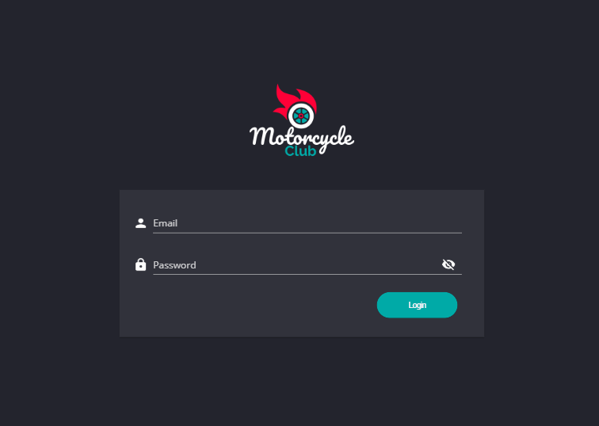

# Motorcycle Club - Login
> A simple login model

# About this Project

This login was created to train login validations

# Why?

This project is part of my personal portfolio and I would be very happy to receive feedback about the project, code, structure, anything that can make me a better developer!

E-mail: <a href="mailto:tthheusalmeida@gmail.com">tthheusalmeida@gmail.com</a>  
LinkedIn: <a href="https://www.linkedin.com/in/matheus-almeida-602139182/" target="_blank">matheus-almeida-602139182</a>

Also, you can use this project however you want, it is free to copy, change, improve ...

# Functionality

- Enter (or not) the requested values for each field.
- The application takes care to validate and respond to those who use what and need to add / exchange

# How to use?

- <a href="https://help.github.com/en/github/creating-cloning-and-archiving-repositories/cloning-a-repository">Clone</a> this repository to your local machine using `https://github.com/tthheusalmeida/motorcycle-club-login.git`
- Unzip the cloned file
- Open the `motorcycle-club-login-master` folder
- Double click on the `index.html` file
- Enter the values corresponding to each field
- Press Login button

# Note

- The email is valid when it contains '@' and '.'.
- The password is valid when the field is not empty.

# Built With

- <a href="https://html.spec.whatwg.org/multipage/">HTML</a> - Markup for page
- <a href="https://www.w3.org/Style/CSS/Overview.en.html">CSS</a> - Style for page
- <a href="http://www.ecmascript.org/">JavaScript</a> - Manipulation of page features
- <a href="http://www.freelogodesign.org/">FreeLogoDesign</a> - Website to create fast logo

# License

- <a href="https://github.com/tthheusalmeida/motorcycle-club-login/blob/master/LICENSE">MIT</a>
